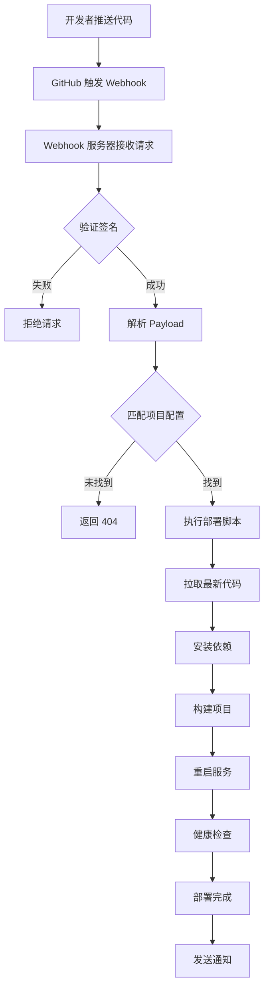

# GitHub Webhook 自动部署系统 - 项目概览

## 🎯 项目简介

这是一个完整的 GitHub Webhook 自动部署解决方案，当代码推送到 GitHub 时自动触发部署流程。系统包含 Node.js webhook 服务器和 bash 部署脚本，支持多项目管理、安全验证、日志记录和监控功能。

## 📁 项目结构

```
webhook-server/
├── 📄 核心文件
│   ├── server.js              # 主服务器文件
│   ├── package.json           # 项目依赖配置
│   ├── ecosystem.config.js    # PM2 配置文件
│   └── projects.json          # 项目配置文件
│
├── 🔧 配置文件
│   ├── .env.example           # 环境变量模板
│   └── nginx.conf.example     # Nginx 配置示例
│
├── 📜 部署脚本
│   └── scripts/
│       ├── deploy-blog.sh     # Web Blog 部署脚本
│       └── rollback-blog.sh   # 回滚脚本
│
├── 🛠️ 管理工具
│   ├── install.sh             # 一键安装脚本
│   ├── start.sh               # 快速启动脚本
│   ├── test.sh                # 系统测试脚本
│   └── monitor.sh             # 监控面板脚本
│
└── 📚 文档
    ├── README.md              # 项目说明文档
    ├── USAGE.md               # 详细使用指南
    └── PROJECT_OVERVIEW.md    # 项目概览（本文件）
```

## 🚀 核心功能

### 1. Webhook 服务器 (server.js)
- ✅ GitHub 签名验证
- ✅ 多项目支持
- ✅ 异步部署处理
- ✅ 详细日志记录
- ✅ 健康检查端点
- ✅ 手动部署触发
- ✅ 错误处理和恢复

### 2. 部署脚本系统
- ✅ 自动代码拉取
- ✅ 依赖管理 (npm/pnpm/yarn)
- ✅ 项目构建
- ✅ 服务重启 (PM2)
- ✅ 健康检查验证
- ✅ 备份和回滚
- ✅ 彩色日志输出

### 3. 管理工具集
- ✅ 一键安装配置
- ✅ 快速启动服务
- ✅ 实时监控面板
- ✅ 自动化测试
- ✅ 系统状态检查

## 🔄 工作流程



## 🛡️ 安全特性

### 1. 多层安全验证
- **签名验证**: HMAC-SHA256 验证请求来源
- **IP 白名单**: 可选的 GitHub IP 范围限制
- **HTTPS 支持**: 通过 Nginx 反向代理
- **权限控制**: 最小化脚本执行权限

### 2. 错误处理
- **超时保护**: 防止长时间运行的部署
- **回滚机制**: 自动备份和快速回滚
- **日志审计**: 完整的操作日志记录
- **异常恢复**: 服务自动重启和恢复

## 📊 监控和日志

### 1. 实时监控
```bash
./monitor.sh -r    # 实时监控模式
```
- 服务运行状态
- 系统资源使用
- 部署成功率统计
- 最近操作日志

### 2. 日志系统
- **应用日志**: `logs/webhook.log`
- **PM2 日志**: `logs/out.log`, `logs/err.log`
- **部署日志**: 脚本执行详细记录
- **访问日志**: Nginx 访问记录

## 🔧 配置管理

### 1. 环境配置 (.env)
```bash
WEBHOOK_SECRET=your_secure_secret
WEBHOOK_PORT=3001
LOG_LEVEL=info
ENABLE_IP_WHITELIST=false
```

### 2. 项目配置 (projects.json)
```json
{
  "projects": {
    "web-blog": {
      "repository": "username/web-blog",
      "branch": "main",
      "path": "/path/to/project",
      "scripts": {
        "deploy": "./scripts/deploy-blog.sh"
      },
      "services": ["blog-server", "blog-client"]
    }
  }
}
```

## 🚀 快速开始

### 1. 安装系统
```bash
cd webhook-server
./install.sh
```

### 2. 配置项目
```bash
# 编辑环境变量
vim .env

# 配置项目信息
vim projects.json
```

### 3. 启动服务
```bash
./start.sh
```

### 4. 配置 GitHub
在 GitHub 仓库设置中添加 Webhook：
- URL: `http://your-server:3001/webhook`
- Secret: 与 `.env` 中的 `WEBHOOK_SECRET` 相同

## 🎛️ 管理命令

### 服务管理
```bash
./start.sh              # 启动服务
pm2 restart webhook-server  # 重启服务
pm2 stop webhook-server     # 停止服务
pm2 logs webhook-server     # 查看日志
```

### 监控和测试
```bash
./monitor.sh            # 系统监控
./test.sh               # 运行测试
curl localhost:3001/health  # 健康检查
```

### 手动部署
```bash
curl -X POST localhost:3001/deploy/web-blog
```

## 🔄 扩展功能

### 1. 多环境支持
- 开发环境 (develop 分支)
- 测试环境 (staging 分支)  
- 生产环境 (main 分支)

### 2. 通知集成
- 钉钉机器人通知
- 邮件通知
- Slack 集成
- 微信企业号

### 3. 高级部署策略
- 蓝绿部署
- 滚动更新
- 金丝雀发布
- A/B 测试

## 📈 性能优化

### 1. 服务器优化
- PM2 多实例部署
- Nginx 负载均衡
- 缓存策略优化
- 资源使用监控

### 2. 部署优化
- 增量构建
- 并行处理
- 缓存依赖
- 压缩传输

## 🛠️ 故障排除

### 常见问题
1. **502 错误**: 检查服务状态和端口占用
2. **部署失败**: 查看部署日志和权限设置
3. **签名验证失败**: 确认 Secret 配置正确
4. **权限错误**: 检查文件和目录权限

### 调试工具
```bash
./test.sh               # 系统测试
./monitor.sh -s         # 服务状态
tail -f logs/webhook.log    # 实时日志
pm2 monit               # PM2 监控
```

## 🔮 未来规划

### 短期目标
- [ ] Web 管理界面
- [ ] 更多通知方式
- [ ] 部署队列管理
- [ ] 配置热重载

### 长期目标
- [ ] 容器化部署
- [ ] 集群支持
- [ ] 图形化监控
- [ ] API 文档生成

## 📞 技术支持

### 文档资源
- `README.md`: 基础使用说明
- `USAGE.md`: 详细使用指南
- `nginx.conf.example`: Nginx 配置参考

### 调试信息
```bash
# 系统信息
./monitor.sh

# 测试结果
./test.sh

# 服务日志
pm2 logs webhook-server
```

## 🤝 贡献指南

1. Fork 项目
2. 创建功能分支
3. 提交更改
4. 推送到分支
5. 创建 Pull Request

## 📄 许可证

MIT License - 详见 LICENSE 文件

---

**项目状态**: ✅ 生产就绪  
**最后更新**: 2024-12-01  
**维护者**: Your Name  

🎉 **恭喜！你现在拥有了一个完整的 GitHub Webhook 自动部署系统！**